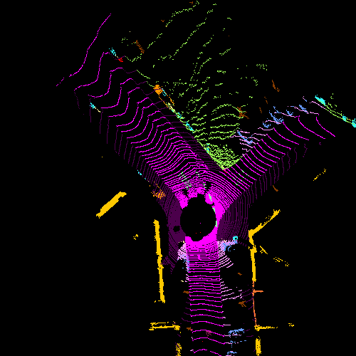

# BEV Projection for SemKITTI Dataset

This repository is for multi-channel Bird-Eye-Projection for SemKITTI dataset. This package produces rgb images using the pooint cloud data and semantic labels, where each color represents a specific semantic class.

## Requirements 

- PCL
- OpenCV

## Data Structure

Please download SemKITTI dataset and ensure the following structure
```
./dataset/
├── 
├── ...
└── SemanticKitti/
    ├──sequences
        ├── 00/           
        │   ├── velodyne/	
        |   |	├── 000000.bin
        |   |	├── 000001.bin
        |   |	└── ...
        │   └── labels/ 
        |   |   ├── 000000.label
        |   |   ├── 000001.label
        |   |   └── ...
        |   └── image_2/ 

```

## Run Packages

```shell script
./BEV_projection /home/user/dataset/SemKitti/sequences/00/

```

## Sample Output


